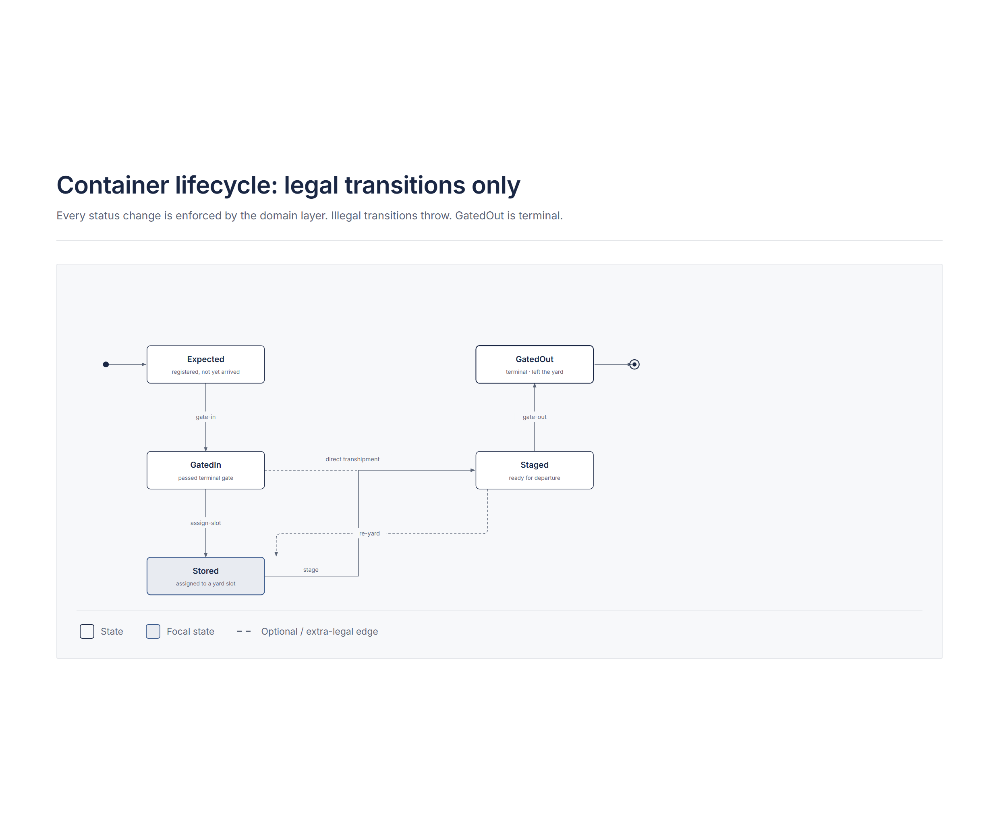
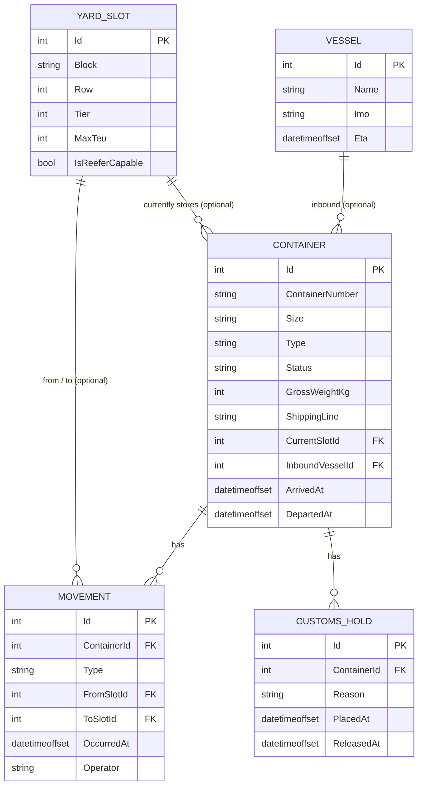
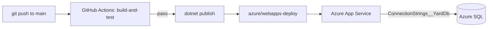

# PortYard

[](https://github.com/Bergstefann/container-yard-management/actions/workflows/ci.yml)
[](LICENSE)



Container yard management API for a port terminal, built with ASP.NET Core and EF Core.

**Live**: https://portyard-api.azurewebsites.net ([/swagger](https://portyard-api.azurewebsites.net/swagger), [/health](https://portyard-api.azurewebsites.net/health))

## What this is, and why

A container terminal has to answer three questions correctly, all the time. Where is every box sitting? Which ones is it legally allowed to release? How full is the yard? Get any of those wrong and you get a container nobody can locate, cargo released under an active customs hold, or a yard block that silently overflows.

PortYard models that directly. Containers move through a strict lifecycle. Every physical move is written to an append-only ledger. The rules governing slot capacity, reefer placement, and customs holds are enforced by the domain model, not trusted to whichever caller is writing to the database.

It's a portfolio project, not a production system. Even so, it's built the way the problem deserves: a domain layer with no framework dependencies and real invariants, a persistence layer that maps cleanly onto it, and a test suite that proves the business rules hold.

## Domain rules

The invariants the domain layer enforces, and the test suite proves:

- **Legal status transitions only.** `Expected → GatedIn → Stored → Staged → GatedOut`, plus two extra legal edges: `GatedIn → Staged` (direct transhipment) and `Staged → Stored` (re-yarded). Everything else throws. `GatedOut` is terminal.
- **A container occupies at most one slot.** Assigning to a new slot clears the previous one and records a single Yard movement carrying both.
- **Slot capacity in TEU is never exceeded.** 20ft is 1 TEU, 40ft and 45ft are 2 TEU. An assignment that would breach `MaxTeu` is rejected.
- **Reefers only go in reefer-capable slots.**
- **No gate-out under an active customs hold.** Releasing the hold permits it.
- **Movements are append-only and chronologically consistent.** A new movement can never predate the container's most recent one, and nothing mutates a movement once recorded.
- **Container numbers are unique and ISO 6346-valid**, enforced at the API boundary and by a unique database index.

`GatedOut` is terminal; any other transition throws.

## Quick start

PortYard runs against SQL Server. Start one locally with Docker:

```bash
docker run -e "ACCEPT_EULA=Y" -e "MSSQL_SA_PASSWORD=YourStrong!Passw0rd" -p 1433:1433 -d mcr.microsoft.com/mssql/server:2022-latest
```

CI uses the same image. The password is Microsoft's documented placeholder for it, not a real credential, and `appsettings.json` already matches it, so no local configuration is needed.

```bash
git clone https://github.com/Bergstefann/container-yard-management.git
cd container-yard-management
dotnet run --project src/PortYard.Api
```

The schema is applied and seeded automatically on first run in Development. Open `https://localhost:<port>/swagger` (the port prints on startup) to try every endpoint, or `/health` to check the app can reach the database.

No Docker? Point `ConnectionStrings:YardDb` at an [Azure SQL free-tier database](https://azure.microsoft.com/en-us/products/azure-sql/database/) instead. Same schema, same migration, no code changes.

## Architecture

```
src/
├── PortYard.Domain/   entities, enums, ISO 6346 validation, domain exceptions
└── PortYard.Api/      contracts (DTOs), controllers, EF Core, services, middleware
tests/
└── PortYard.Tests/    unit tests (domain) and integration tests (API)
```

`PortYard.Domain` references nothing outside the base class library. Every business rule lives on the entities as methods (`Container.GateIn()`, `AssignToSlot()`, `Stage()`, `GateOut()`), so each one unit tests in memory in milliseconds, with no database and no HTTP pipeline.

`PortYard.Api` depends on `PortYard.Domain`, never the reverse. Controllers call thin services. Services orchestrate EF Core and call domain methods. Those domain methods are the only code path that can change a container's state.

## API endpoints

| Method | Route | Description |
|---|---|---|
| GET | `/api/containers` | Paged, filterable list (status, size, type, shippingLine, block) |
| GET | `/api/containers/{containerNumber}` | Full detail: current slot, active holds, movement history |
| POST | `/api/containers` | Register a new expected container |
| POST | `/api/containers/{containerNumber}/gate-in` | Expected → GatedIn |
| POST | `/api/containers/{containerNumber}/assign-slot` | Assign to a yard slot (→ Stored) |
| POST | `/api/containers/{containerNumber}/stage` | Stage for departure |
| POST | `/api/containers/{containerNumber}/gate-out` | Staged → GatedOut |
| GET | `/api/slots` | All yard slots with occupancy and remaining TEU |
| GET | `/api/slots/{code}` | Slot detail, including occupying containers |
| POST | `/api/containers/{containerNumber}/holds` | Place a customs hold |
| POST | `/api/holds/{id}/release` | Release a customs hold |
| GET | `/api/reports/yard-utilisation` | Occupancy by block: slots and TEU used vs capacity |
| GET | `/api/reports/dwell-time` | Average/median dwell time by shipping line and container type |
| GET | `/api/reports/throughput` | Gate-in/gate-out counts by day, over a date range |

## Data model




## Deployment

Deployed to Azure App Service (Linux, .NET 10) against Azure SQL, both on free tiers.



`.github/workflows/ci.yml` has two jobs. `build-and-test` runs on every push and PR, building and then running the full suite against a real SQL Server service container. `deploy` runs only after that passes, and only on a push to `main`, so a fork can't trigger a deploy.

The App Service reads its connection string from the `ConnectionStrings__YardDb` Application Setting. `Program.cs` picks it up via `GetConnectionString("YardDb")` with no code change. The double underscore is ASP.NET Core's standard convention for nested configuration keys in environment variables.

Schema changes are applied by running this against the target database before traffic is routed to the new version, never automatically at startup outside Development. See the design note below.

```bash
dotnet ef database update
```

**Next improvement:** managed identity between App Service and Azure SQL, removing the password from the connection string entirely. The deploy currently uses a publish profile with Basic Auth enabled on that single app.

## Testing

```bash
dotnet test
```

65 tests: 53 unit tests against the domain layer with no database (ISO 6346 validation, legal and illegal status transitions, slot capacity, movement chronology), plus 12 integration tests running the full ASP.NET Core pipeline against real SQL Server via `WebApplicationFactory`.

Each test class gets its own uniquely named database, created via `Database.Migrate()` and dropped on disposal. That's the same call `Program.cs` makes in Development, so a green run also proves the committed migration matches the current model. EF Core's `UseInMemoryDatabase` provider wouldn't prove that. It doesn't enforce foreign keys or unique indexes, and it never exercises real T-SQL.

The integration suite needs a reachable SQL Server. The local Docker container from Quick Start works, or set `PORTYARD_TEST_CONNECTION_STRING` to point elsewhere. CI runs against a fresh `mcr.microsoft.com/mssql/server:2022-latest` service container every time.

## Design decisions and trade-offs

**SQL Server, not SQLite.** This ran on SQLite through most of development, which meant a reviewer could clone and run it with zero setup. It moved to SQL Server once the point became being deployed rather than just being clonable. A demo that only proves it runs on SQLite doesn't demonstrate it runs on the database it's actually deployed against. Nothing in the domain layer changed for the swap, which was the bet the SQLite choice made. The cost is that "zero setup" became "one `docker run`."

**Migrations run at startup only in Development.** The startup path was originally the
only place schema got created, so a non-Development environment that never reached a
successful startup run started with no schema and 500'd on the first request. Auto-migrating on boot is also the wrong place for it once there's more than one instance: two instances racing to migrate the same database is a real failure mode. Migrations belong to the deploy pipeline. Development keeps auto-migrate-and-seed for a zero-setup `dotnet run`, Staging seeds demo data onto an already-migrated schema, and Production does neither at runtime.

**Enums stored as strings, not ints.** A `Status` column reading `'Stored'` is debuggable by eye. One reading `2` isn't. Storage cost is trivial at this scale.

**The movement ledger is append-only by construction**, not convention. No method on `Movement` mutates an existing record, and `Container` only ever adds to its collection. That's what makes it trustworthy as an audit trail.

**No authentication.** Every write records a fixed `"gate-system"` operator rather than an authenticated user. This is the first thing I'd add next. Per-operator attribution matters as soon as this stops being a demo.

**Optimistic concurrency on slot assignment**, via `YardSlot.LastModifiedAt` mapped as `IsConcurrencyToken()`. Two concurrent `assign-slot` calls can each read the slot before either writes, and both pass the capacity check against a stale snapshot. Without this, both commit and overfill the slot. The second writer's `SaveChanges` now throws `DbUpdateConcurrencyException`, which `ContainerService.AssignSlotAsync` catches and returns as a 409. `SlotConcurrencyTests` reproduces the race deterministically with two `DbContext`s rather than depending on thread timing.

It's `IsConcurrencyToken()` rather than `IsRowVersion()` because SQLite has no server-generated rowversion type, so the domain sets it explicitly on every occupancy change. That also means the mechanism survives a database provider change.

**No real vessel scheduling.** Vessels exist only as a nullable reference containers can point to. No berth planning, no ETA-driven workflow. That's a larger project.

**`/health` checks the database, not just the process.** `AddDbContextCheck<YardDbContext>()` means an instance whose SQL connection has died reports unhealthy and gets pulled from rotation, rather than serving requests that will all fail.

**CORS is configuration-driven and off by default.** No frontend exists yet, so there's no origin to hardcode. `Cors:AllowedOrigins` becomes an App Service Application Setting the day a real caller needs it, with no code change.

## License

[MIT](LICENSE)
