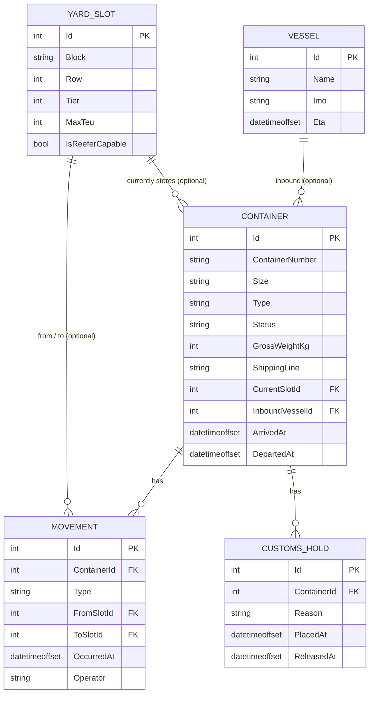

# PortYard

Container yard management API for a port terminal, built with ASP.NET Core and EF Core.

[](https://github.com/Bergstefann/container-yard-management/actions/workflows/ci.yml)

## What this is, and why

A container terminal has to answer three questions correctly, all the time: where is every box physically sitting, which ones is the terminal legally allowed to release through the gate, and how full is the yard right now. Get any of those wrong and the consequences are concrete — a container nobody can locate, cargo released under an active customs hold, or a yard block that silently overflows its capacity. PortYard models that domain directly: containers move through a strict lifecycle (expected, gated in, stored, staged, gated out), every physical move is written to an append-only ledger, and the rules that govern slot capacity, reefer placement, and customs holds are enforced by the domain model itself rather than trusted to whichever caller happens to be writing to the database that day.

This is a portfolio project, not a production system, but it's built the way the underlying problem deserves: a domain layer with no framework dependencies and real invariants, a persistence layer that maps cleanly onto it, a REST API that never lets a controller mutate state directly, and a test suite that exists to prove the business rules hold rather than to pad a coverage number.

## Quick start

```bash
git clone https://github.com/Bergstefann/container-yard-management.git
cd container-yard-management
dotnet run --project src/PortYard.Api
```

The SQLite database is created and seeded automatically on first run — no external database, no setup step. Open `https://localhost:<port>/swagger` (the port is printed on startup) to browse and try every endpoint.

## Architecture

```
src/
├── PortYard.Domain/   entities, enums, ISO 6346 validation, domain exceptions
└── PortYard.Api/      contracts (DTOs), controllers, EF Core, services, middleware
tests/
└── PortYard.Tests/    unit tests (domain) and integration tests (API)
```

`PortYard.Domain` has no reference to EF Core, ASP.NET Core, or anything else outside the base class library. Every business rule — legal status transitions, slot capacity, reefer placement, customs holds, movement chronology — lives on the entities themselves as methods (`Container.GateIn()`, `AssignToSlot()`, `Stage()`, `GateOut()`), and every one of those methods can be unit tested in memory, in milliseconds, with no database and no HTTP pipeline. `PortYard.Api` depends on `PortYard.Domain`, never the other way round: controllers call into thin services, services orchestrate EF Core and call the domain methods, and the domain methods are the only code path that can change a container's state.

## Domain rules

These are the invariants the domain layer enforces and the test suite exists to prove:

- **Legal status transitions only.** `Expected → GatedIn → Stored → Staged → GatedOut`, with two additional legal edges: `GatedIn → Staged` (direct transhipment, a container that's never actually yarded) and `Staged → Stored` (re-yarded). Every other transition throws. `GatedOut` is terminal.
- **A container occupies at most one slot.** Assigning a container to a new slot clears its previous slot and records a single Yard movement carrying both the from and to slot.
- **Slot capacity, in TEU, is never exceeded.** A 20ft container is 1 TEU; 40ft and 45ft are 2 TEU. An assignment that would push a slot over its `MaxTeu` is rejected.
- **Reefers only go in reefer-capable slots.** Assigning a reefer container to a slot without power throws.
- **No gate-out under an active customs hold.** A container with any unreleased hold cannot gate out; releasing the hold permits it.
- **Movements are append-only and chronologically consistent.** A new movement can never be dated earlier than the container's most recent one, and nothing ever mutates a movement once it's recorded.
- **Container numbers are unique and ISO 6346-valid**, enforced both at the API boundary (a malformed number never reaches the domain layer) and by a unique database index.

## API endpoints

| Method | Route | Description |
|---|---|---|
| GET | `/api/containers` | Paged, filterable list (status, size, type, shippingLine, block) |
| GET | `/api/containers/{containerNumber}` | Full detail: current slot, active holds, movement history |
| POST | `/api/containers` | Register a new expected container |
| POST | `/api/containers/{containerNumber}/gate-in` | Expected → GatedIn |
| POST | `/api/containers/{containerNumber}/assign-slot` | Assign to a yard slot (→ Stored) |
| POST | `/api/containers/{containerNumber}/stage` | Stage for departure |
| POST | `/api/containers/{containerNumber}/gate-out` | Staged → GatedOut |
| GET | `/api/slots` | All yard slots with occupancy and remaining TEU |
| GET | `/api/slots/{code}` | Slot detail, including occupying containers |
| POST | `/api/containers/{containerNumber}/holds` | Place a customs hold |
| POST | `/api/holds/{id}/release` | Release a customs hold |
| GET | `/api/reports/yard-utilisation` | Occupancy by block: slots and TEU used vs capacity |
| GET | `/api/reports/dwell-time` | Average/median dwell time by shipping line and container type |
| GET | `/api/reports/throughput` | Gate-in/gate-out counts by day, over a date range |

## Data model



## Testing

```bash
dotnet test
```

64 tests: 53 unit tests against the domain layer (ISO 6346 validation, status transitions — legal and illegal — slot capacity, and movement chronology) with no database involved, plus 11 integration tests that run the full ASP.NET Core pipeline against a real SQLite database via `WebApplicationFactory`. The integration tests deliberately use a live SQLite connection rather than EF Core's `UseInMemoryDatabase` provider, because that provider doesn't enforce relational constraints — foreign keys and unique indexes — which would silently defeat the point of testing them. Schema is applied via `Database.Migrate()`, the same call `Program.cs` makes in Development, so a green run here also proves the committed migrations match the current model — not just that `EnsureCreated` can build a database that does.

## Design decisions and trade-offs

**SQLite, not SQL Server or PostgreSQL.** A reviewer should be able to clone this repository and run it with zero setup. In a real deployment this would be PostgreSQL or SQL Server; nothing in the domain layer or the EF Core configuration is SQLite-specific enough to make that migration painful.

**Migrations run at app startup only in Development (and demo data only in Development and Staging).** This used to be gated on `!IsDevelopment()`, which meant *any* non-Development environment — Staging, Production, anything — started with no schema and no data, and would 500 on the first real request. Applying a migration automatically whenever an instance happens to boot is also just the wrong place for it once there's more than one instance: two instances racing to migrate the same database on startup is a real failure mode, not a hypothetical one. Migrations belong to the deploy pipeline (`dotnet ef database update`, run once, before traffic is ever routed to the new version) — Development keeps the auto-migrate-and-seed convenience for a zero-setup `dotnet run`, Staging seeds demo data onto an already-migrated schema so a reviewer gets a populated yard without ever touching a production database, and Production does neither at runtime.

**Enums stored as strings, not ints.** A `Status` column that reads `'Stored'` in the database is a schema you can debug by eye; a column that reads `2` is not. The storage cost is trivial at this scale.

**The movement ledger is append-only by construction**, not by convention — there is no method on `Movement` that mutates an existing record, and `Container` only ever adds to its movement collection. That's what makes it trustworthy as an audit trail: a movement, once recorded, cannot quietly change under you.

**No authentication.** Every write endpoint records a fixed `"gate-system"` operator rather than an authenticated user. Given a next iteration, this is the first thing I'd add — real per-operator attribution matters as soon as this stops being a demo.

**Optimistic concurrency on slot assignment**, via `YardSlot.LastModifiedAt` mapped as an `IsConcurrencyToken()` (not `IsRowVersion()` — SQLite has no server-generated rowversion type the way SQL Server does, so the domain sets it explicitly on every occupancy change instead, which also means the mechanism doesn't change when the database provider does). Two concurrent `assign-slot` calls for the same slot can each read it before either one writes, each individually pass the capacity check against that now-stale snapshot, and — without this — both commit, over-filling the slot past `MaxTeu`. The second writer's `SaveChanges` now fails with `DbUpdateConcurrencyException` instead, which `ContainerService.AssignSlotAsync` catches and turns into the same 409 every other domain conflict returns. Covered by `SlotConcurrencyTests`, which reproduces the race deterministically (two `DbContext`s, each loading its own snapshot before either saves) rather than depending on real thread timing.

**No real vessel scheduling.** Vessels exist only as a nullable reference containers can point to; there's no berth planning, no ETA-driven workflow. That's a different, larger project.
